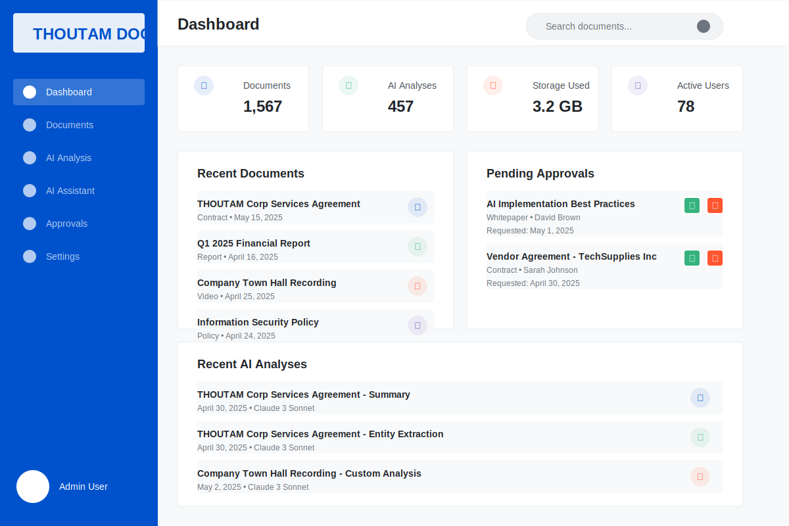
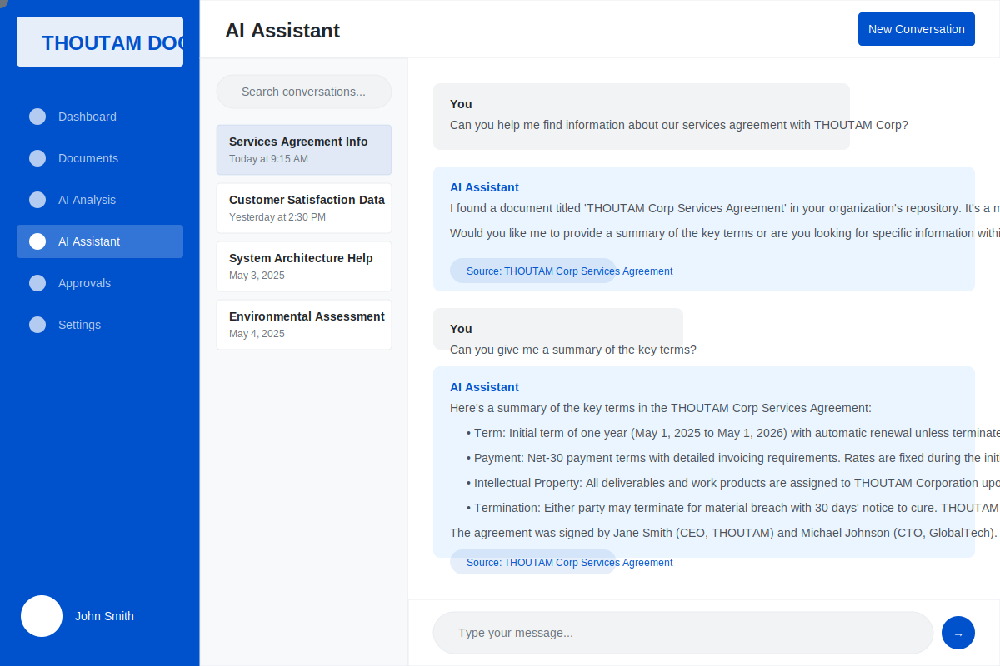

# AWS Bedrock for AI-powered document analysis and processing

A serverless multi-tier application leveraging AWS Bedrock for AI-powered document analysis and processing.

## System Architecture Diagram


This diagram illustrates the complete serverless architecture including all the layers described above, their interactions, and data flows.

## Architecture Overview

The application is built using a multi-layered architecture:

## Overview

BedrockAI is a scalable, secure application that provides:
- Document analysis using AWS Bedrock AI capabilities
- Multi-tenant architecture with isolated data
- Secure document storage and processing
- Real-time AI analysis and chat features
- Comprehensive user management and access control

## Architecture

The application uses various AWS services:
- AWS Bedrock for AI/ML capabilities
- API Gateway for RESTful endpoints
- Lambda for serverless compute
- DynamoDB for document metadata
- S3 for document storage
- Cognito for authentication
- CloudFront for content delivery
- CloudWatch for monitoring

## Prerequisites

Before deploying the application, ensure you have:

1. AWS CLI installed and configured
2. Node.js and npm installed
3. Python 3.11 installed
4. Appropriate AWS permissions
5. Git (for version control)

## Installation Steps

### Step 1: Configure AWS CLI and Environment

```bash
# Configure AWS CLI with your credentials
aws configure

# Set up environment variables for deployment
export PROJECT_NAME=bedrock-ai
export STAGE=dev  # Can be dev, test, or prod
export AWS_REGION=us-east-1  # Or your preferred region
export ADMIN_EMAIL=your.email@example.com
```

### Step 2: Create S3 Bucket for CloudFormation Assets

```bash
# Create an S3 bucket to store CloudFormation assets
aws s3 mb s3://${PROJECT_NAME}-${STAGE}-cfn-assets --region ${AWS_REGION}

# Upload sample data to S3
aws s3 cp sample-data/ s3://${PROJECT_NAME}-${STAGE}-cfn-assets/sample-data/ --recursive
```

### Step 3: Deploy Core Infrastructure

```bash
# Validate the CloudFormation template
aws cloudformation validate-template \
  --template-body file://cloudformation/cloudformation-template.txt

# Create the CloudFormation stack
aws cloudformation create-stack \
  --stack-name ${PROJECT_NAME}-${STAGE} \
  --template-body file://cloudformation/cloudformation-template.txt \
  --parameters \
    ParameterKey=ProjectName,ParameterValue=${PROJECT_NAME} \
    ParameterKey=Stage,ParameterValue=${STAGE} \
    ParameterKey=AdminEmail,ParameterValue=${ADMIN_EMAIL} \
    ParameterKey=BedrockModelId,ParameterValue=anthropic.claude-3-sonnet-20240229-v1:0 \
  --capabilities CAPABILITY_IAM \
  --tags Key=Project,Value=${PROJECT_NAME} Key=Stage,Value=${STAGE}

# Wait for stack creation to complete
aws cloudformation wait stack-create-complete \
  --stack-name ${PROJECT_NAME}-${STAGE}
```

### Step 4: Get Stack Outputs

```bash
# Get important stack outputs
aws cloudformation describe-stacks \
  --stack-name ${PROJECT_NAME}-${STAGE} \
  --query 'Stacks[0].Outputs' \
  --output table

# Store important values in environment variables
export API_ENDPOINT=$(aws cloudformation describe-stacks --stack-name ${PROJECT_NAME}-${STAGE} --query 'Stacks[0].Outputs[?OutputKey==`ApiEndpoint`].OutputValue' --output text)
export USER_POOL_ID=$(aws cloudformation describe-stacks --stack-name ${PROJECT_NAME}-${STAGE} --query 'Stacks[0].Outputs[?OutputKey==`UserPoolId`].OutputValue' --output text)
export USER_POOL_CLIENT_ID=$(aws cloudformation describe-stacks --stack-name ${PROJECT_NAME}-${STAGE} --query 'Stacks[0].Outputs[?OutputKey==`UserPoolClientId`].OutputValue' --output text)
export DYNAMODB_TABLE=$(aws cloudformation describe-stacks --stack-name ${PROJECT_NAME}-${STAGE} --query 'Stacks[0].Outputs[?OutputKey==`DynamoTableName`].OutputValue' --output text)
export DOCUMENT_BUCKET=$(aws cloudformation describe-stacks --stack-name ${PROJECT_NAME}-${STAGE} --query 'Stacks[0].Outputs[?OutputKey==`DocumentBucketName`].OutputValue' --output text)
```

### Step 5: Deploy Lambda Functions

```bash
# Install AWS SAM CLI if not already installed
pip install aws-sam-cli

# Navigate to lambda directory
cd lambda

# Install dependencies for all Lambda functions
npm install -g typescript
npm install --save \
  aws-sdk \
  @types/aws-sdk \
  @types/node \
  jest \
  @types/jest \
  ts-jest

# Build and deploy Lambda functions using SAM
sam build
sam deploy \
  --stack-name ${PROJECT_NAME}-${STAGE}-lambda \
  --capabilities CAPABILITY_IAM \
  --parameter-overrides \
    ProjectName=${PROJECT_NAME} \
    Stage=${STAGE} \
    DynamoTableName=${DYNAMODB_TABLE} \
    DocumentBucketName=${DOCUMENT_BUCKET} \
    UserPoolId=${USER_POOL_ID} \
    UserPoolClientId=${USER_POOL_CLIENT_ID} \
    BedrockModelId=anthropic.claude-3-sonnet-20240229-v1:0

# Wait for deployment to complete
aws cloudformation wait stack-create-complete \
  --stack-name ${PROJECT_NAME}-${STAGE}-lambda

# Get Lambda function ARNs
export AUTH_FUNCTION_ARN=$(aws cloudformation describe-stacks --stack-name ${PROJECT_NAME}-${STAGE}-lambda --query 'Stacks[0].Outputs[?OutputKey==`AuthFunction`].OutputValue' --output text)
export USERS_FUNCTION_ARN=$(aws cloudformation describe-stacks --stack-name ${PROJECT_NAME}-${STAGE}-lambda --query 'Stacks[0].Outputs[?OutputKey==`UsersFunction`].OutputValue' --output text)
export DOCUMENTS_FUNCTION_ARN=$(aws cloudformation describe-stacks --stack-name ${PROJECT_NAME}-${STAGE}-lambda --query 'Stacks[0].Outputs[?OutputKey==`DocumentsFunction`].OutputValue' --output text)
export AI_FUNCTION_ARN=$(aws cloudformation describe-stacks --stack-name ${PROJECT_NAME}-${STAGE}-lambda --query 'Stacks[0].Outputs[?OutputKey==`AiFunction`].OutputValue' --output text)
export DATA_FUNCTION_ARN=$(aws cloudformation describe-stacks --stack-name ${PROJECT_NAME}-${STAGE}-lambda --query 'Stacks[0].Outputs[?OutputKey==`DataFunction`].OutputValue' --output text)

# Return to project root
cd ..
```

### Step 6: Initialize DynamoDB with Sample Data

```bash
# Create a script to load sample data
cat > load-sample-data.js << 'EOF'
const AWS = require('aws-sdk');
const fs = require('fs');

const dynamodb = new AWS.DynamoDB.DocumentClient();
const documentsTable = process.env.DYNAMODB_TABLE;
const analysisTable = process.env.ANALYSIS_TABLE;

async function loadData(fileName, tableName) {
  const data = JSON.parse(fs.readFileSync(`sample-data/${fileName}`));
  
  for (const item of data) {
    await dynamodb.put({
      TableName: tableName,
      Item: item
    }).promise();
  }
}

async function main() {
  // Load documents and users
  await loadData('sample-users.json', documentsTable);
  await loadData('sample-tenants.json', documentsTable);
  await loadData('sample-documents.json', documentsTable);
  
  // Load analysis and conversations
  await loadData('sample-analysis.json', analysisTable);
  await loadData('sample-conversations.json', analysisTable);
  
  // Load tenant configurations
  await loadData('sample-tenant-config.json', documentsTable);
  
  console.log('Sample data loaded successfully');
}

main().catch(console.error);
EOF

# Install dependencies and run the script
npm init -y
npm install aws-sdk
node load-sample-data.js
```

### Step 7: Set Up Web Client

```bash
# Clone or create web client directory
cd web-client

# Create environment file
cat > .env << EOF
REACT_APP_API_ENDPOINT=${API_ENDPOINT}
REACT_APP_USER_POOL_ID=${USER_POOL_ID}
REACT_APP_USER_POOL_CLIENT_ID=${USER_POOL_CLIENT_ID}
REACT_APP_USER_POOL_DOMAIN=${USER_POOL_DOMAIN}
REACT_APP_REGION=${AWS_REGION}
REACT_APP_STAGE=${STAGE}
REACT_APP_ENABLE_AI_ANALYSIS=true
REACT_APP_ENABLE_DOCUMENT_UPLOAD=true
REACT_APP_ENABLE_MULTI_TENANT=true
EOF

# Install dependencies and build
npm install
npm run build

# Deploy to S3 bucket
export CLOUDFRONT_DOMAIN=$(aws cloudformation describe-stacks --stack-name ${PROJECT_NAME}-${STAGE} --query 'Stacks[0].Outputs[?OutputKey==`CloudFrontDomain`].OutputValue' --output text)
aws s3 sync build/ s3://${PROJECT_NAME}-${STAGE}-web-client/
```

### Step 8: Create Initial Admin User

```bash
# Create admin user in Cognito
aws cognito-idp admin-create-user \
  --user-pool-id ${USER_POOL_ID} \
  --username ${ADMIN_EMAIL} \
  --user-attributes \
    Name=email,Value=${ADMIN_EMAIL} \
    Name=email_verified,Value=true \
    Name=given_name,Value=Admin \
    Name=family_name,Value=User \
    Name=custom:role,Value=admin

# Add user to admin group
aws cognito-idp admin-add-user-to-group \
  --user-pool-id ${USER_POOL_ID} \
  --username ${ADMIN_EMAIL} \
  --group-name Admins
```

### Step 9: Verify Deployment

```bash
# Test API endpoint
curl ${API_ENDPOINT}/health

# Check CloudWatch logs
aws logs get-log-events \
  --log-group-name /aws/${PROJECT_NAME}/${STAGE} \
  --log-stream-name $(aws logs describe-log-streams --log-group-name /aws/${PROJECT_NAME}/${STAGE} --limit 1 --query 'logStreams[0].logStreamName' --output text)
```

## Post-Deployment Configuration

### Security
- Review and update security group rules
- Configure additional IP restrictions
- Review IAM roles and permissions

### Monitoring
- Check CloudWatch dashboard
- Set up additional alarms
- Configure log retention

### Backup
- Verify DynamoDB backup settings
- Configure S3 lifecycle rules
- Test disaster recovery procedures

### Documentation
- Update API documentation
- Document deployment process
- Create runbooks for common operations

### Testing
- Test user authentication flows
- Verify document upload/download
- Test AI analysis features
- Validate multi-tenant isolation

## Project Structure

```
.
├── cloudformation/           # CloudFormation templates
├── sample-data/             # Sample data for testing
├── web-client/              # React web application
├── lambda/                  # Lambda function code
└── docs/                    # Additional documentation
```

### 1. User Dashboard (Web Interface)



- **Pending Approvals**:
  - 3 contracts awaiting legal review
  - 2 reports pending executive approval
  - 5 documents requiring compliance verification

- **Recent AI Analyses**:
  - Contract risk assessment
  - Market trend analysis
  - Regulatory compliance check
  - Competitive intelligence summary

### 2. Document Viewer with AI Analysis


The document viewer integrates intelligent analysis capabilities:

- **Document Display**: Full contract text with section navigation
- **AI Analysis Panel**:
  ```
  SUMMARY
  This agreement outlines the terms of service between ACME Corporation 
  and the client, including service level requirements, payment terms, 
  confidentiality provisions, and termination conditions.
  ```

- **Key Terms**:
  - Term: 24 months with auto-renewal
  - Payment: Net 30 days
  - Early termination fee: 20% of remaining contract value
  - Confidentiality: 5-year NDA from termination

- **Document Metadata**:
  - Created: May 1, 2025
  - Last modified: May 5, 2025
  - Status: Pending approval
  - Classification: Confidential

- **Action Buttons**:
  - Download
  - Share
  - Request approval
  - Run AI analysis

### 3. AI Assistant Chat Interface



The AI assistant provides contextual document support:

- **Conversation History**:
  - Contract review
  - Marketing strategy
  - Competitor analysis
  - Regulatory inquiries

- **Chat Transcript Example**:
  ```
  User: What are the key terms in the ACME Services Agreement?
  
  AI: Based on the ACME Services Agreement, the key terms include:
  - 24-month contract term with automatic renewal
  - Net 30 payment terms with 1.5% late fee
  - 99.9% uptime SLA with service credits
  - 60-day termination notice required
  
  Would you like me to explain any of these terms in more detail?
  ```

- **Source Citations**:
  - Reference to document section 3.2
  - Link to full agreement
  - Reference to previous version changes

- **Document Summary Cards**:
  - Quick reference cards for mentioned documents
  - Highlighted relevant sections
  - Direct links to document viewers

### 4. Admin Dashboard (Multi-Tenant View)


The admin interface provides system-wide management:

- **System Health Metrics**:
  - API response time: 87ms avg
  - Function invocations: 12.5M daily
  - Error rate: 0.02%
  - Current system load: 42%

- **Usage Analytics**:
  - Peak usage periods
  - Function execution distribution
  - Storage growth trends
  - Cost optimization recommendations

- **Tenant Management**:
  - Provisioning controls
  - Quota management
  - Authentication settings
  - Compliance reporting
